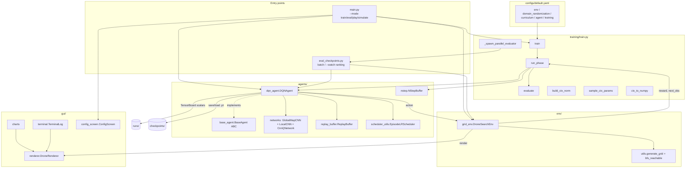

# Architecture

Multi-drone cooperative search **with random drone faults**, trained with
**Independent / parameter-sharing Dueling Double DQN**: a single shared
Q-network drives every drone. This document covers the module layout, the data
flow of one episode, the observation space, the fault model, the neural
network, the context vector, and the project invariants.

> Companion docs: [TRAINING.md](TRAINING.md) (training loop, schedules,
> checkpoints), [ENV.md](ENV.md) (environment internals, rewards),
> [QUICK_REFERENCE.md](QUICK_REFERENCE.md) (cheat sheet),
> [BUGS_AND_IMPROVEMENTS.md](BUGS_AND_IMPROVEMENTS.md).

---

## 1. System overview

`N` drones search a fixed **32×32** grid with random obstacles for one hidden,
BFS-reachable target, in minimum time. Each drone has partial observability (a
vision radius), maintains an accumulated internal map, and fuses maps with nearby
drones (within a communication range). All drones spawn together at one random
corner and must learn to disperse — there is no explicit coordination signal,
only a collision penalty.

**Random faults** (the MAS-proposal extension): at each step a live drone may
break with probability `fault_prob` and stay inactive for the rest of the
episode. Fault knowledge is *decentralized* — a wreck emits a distress beacon
that nearby drones record in their own `Broken` map, and the knowledge spreads
through the usual comm fusion (see §7 Fault model).

The learning algorithm is a **Dueling Double DQN** with n-step returns. Because
every drone shares one network, the agent count, vision radius, comm range,
obstacle density, and fault probability are randomized per episode (**domain
randomization**); the first three are fed to the network as a **context
vector** together with the drone's id and its believed alive count, so a single
policy generalizes across team sizes, sensor ranges, and fault regimes.
Training follows a **curriculum** of phases; phases with `n_episodes: 0` are
skipped, so a run is staged by editing episode counts rather than code.

Key design decisions:

- **Sequential execution.** There is no vectorized `env.step(actions)`. The loop
  calls `env.step_agent(i, action)` once per drone per round; reward, map update,
  and communication fusion happen inside each call. A standard single-action
  `env.step(action)` also exists as a thin round-robin wrapper over `step_agent`
  for Gymnasium API compliance (smoke-tests / generic wrappers); training uses
  `step_agent` directly.
- **Position is a spatial channel.** The agent's own position is encoded as the
  `Own_Position` channel of the global observation (a single `1.0`). The network
  reads it back (argmax) to crop the local patch, so the convolution can also
  reason about position spatially. (Earlier versions carried position out-of-band
  in the context vector; it now lives in the observation.)
- **Single source of truth for normalization.** Context normalization
  denominators are derived from the `domain_randomization` max values, so editing
  those ranges rescales the context everywhere automatically.
- **Batch-size-independent normalization.** The network uses LayerNorm / GRN only
  (no BatchNorm), so a batch-of-1 greedy forward behaves identically to a batched
  training forward.

---

## 2. Module dependency diagram



**Import direction (no cycles):** `networks` depends only on `torch`;
`dqn_agent` imports `networks`, `replay_buffer`, `scheduler_utils`, `base_agent`;
`grid_env` imports `env.utils`; `train` imports `grid_env`, `dqn_agent`,
`nstep`; `main.py` and `eval_checkpoints.py` import from `train`, `grid_env`,
`dqn_agent`. The GUI is a pure *view*, imported lazily by `grid_env.render()`.

---

## 3. Data-flow walkthrough — one training episode

In `training/train.py::run_phase`, for each episode:

1. **Sample DR params.** `sample_ctx_params(dr_cfg)` draws `vision_radius`,
   `comm_range`, `n_agents` uniformly (inclusive `randint`) plus float
   `obstacle_density` and `fault_prob` (uniform) from the phase's DR ranges.
2. **Apply + reset.** `env.set_domain_params(**params)` makes the env's actual
   FOV / comm range / team size / density / fault rate match the sampled values
   (coherent partial observability), then `env.reset()` → `generate_grid` builds
   a BFS-reachable map, all drones spawn at one random corner, each drone's
   vision updates its maps, `_communicate()` fuses drones within the sampled
   `comm_range`, observations are built. The team size for the episode is read
   back as `env.n_agents`.
3. **Per round, until done:**
   1. Collect the live drones (`env.agent_alive`) and build a context array
      **per drone, per round** with `ctx_to_numpy(ctx_params, ctx_norm, i,
      env.n_alive_belief(i))` → normalized `[vision, comm, n_agents, agent_id,
      n_alive_belief]`. The belief can change as faults happen and knowledge
      spreads, so the context is **not** constant within an episode anymore.
   2. Compute action masks `env._get_action_mask(i)` for live drones.
   3. `agent.select_actions_batch(obs_alive, ctx_nps, masks)` — one shared
      forward for all greedy live drones; ε-random for exploring drones (if
      **all** drones explore, no forward runs at all). Dead drones select
      nothing.
   4. For each drone `i` (including wrecks): `env.step_agent(i, action)` returns
      `(obs_i, reward, terminated, truncated, info)`. A wreck's turn is a
      **no-op that still ticks the clock**; a live drone may break at the start
      of its turn (`info["just_broke"]`). Inside a normal step: move/validate,
      revisit + collision + exploration + step/wall reward terms, map update,
      wreck-beacon detection, `_communicate()`, target check.
   5. Each live per-agent step is fed to a per-agent `NStepBuffer`; once a
      window of `n_step` is complete it emits a transition `(s_t, a_t,
      R_t^{(n)}, s_{t+n}, γ^n)` to the replay buffer (the bootstrap discount is
      `0` when the window hits a terminal — **truncation is not terminal**).
      When a drone breaks, its pending window is flushed immediately **with
      bootstrapping** (a fault is a truncation-like event, not a terminal one).
      At episode end the remaining windows are flushed; with
      `shared_target_reward` the team terminal reward is applied first — dead
      drones have empty windows by then and receive nothing.
   6. Every `update_every` agent-steps, `agent.update()` runs one Double-DQN
      gradient step (Huber loss, grad-clip, hard target sync every
      `target_update_freq`).
4. **End of episode.** `agent.step_episode_scheduler()` (warmup→cosine LR, once
   per episode), `agent.decay_epsilon()`, log scalars.
5. **Periodic eval.** Every `eval_every` episodes, `evaluate()` runs on the fixed
   seed set (`_EVAL_SEEDS = 100..119`) so the metric is comparable across epochs;
   a new best (higher success, tie-broken by reward at 100%) is saved to
   `best.pt`.

---

## 4. Observation space

`DroneSearchEnv.observation_space` is `spaces.Dict({"global": Box, "local":
Box})`. Each `step_agent`/`reset` returns, **per agent**, a dict of two flat
`float32` arrays in `[0, 1]`:

| Key | Flat shape (gs = 32) | Channels |
|-----|----------------------|----------|
| `global` | `GLOBAL_CHANNELS · gs² = 6 · 1024 = 6144` | `[Visited, Obstacle, Trajectory, Target, Own_Position, Broken]` |
| `local`  | `LOCAL_CHANNELS · gs² = 5 · 1024 = 5120` | `[Visited, Obstacle, Trajectory, Target, Other_Position]` |

Both streams are full-map (`gs × gs`) flattened channel-major. The **local**
stream adds an `Other_Position` channel marking other drones within the vision
radius. The network reshapes the flat arrays back to `(C, gs, gs)` maps; the
*global* map is consumed whole, while the *local* map is cropped to a `13×13`
patch around the agent before the local encoder sees it.

### Channel semantics

| # | Name | Range / encoding |
|---|------|------------------|
| 0 | Visited | `{0,1}` — cells seen as free by this drone (or comm-shared) |
| 1 | Obstacle | `{0,1}` — discovered obstacles |
| 2 | Trajectory | `clip(visit_count / _TRAJ_CAP, 0, 1)`, `_TRAJ_CAP = 5.0` |
| 3 | Target | `{0,1}` — target position once seen (persists as memory) |
| 4 | Own_Position | `{0,1}` (**global** only) — this drone's own cell (single `1.0`) |
| 5 | Broken | `{0,1}` (**global** only) — crash sites of broken teammates **known to this drone** (beacon/fusion knowledge, not an oracle) |
| 4 | Other_Position | `{0,1}` (**local** only) — other **live** drones within vision |

Channel 4 differs by stream: the **global** stream carries `Own_Position` (the
drone's own cell, recovered by the network via argmax to crop the local patch),
while the **local** stream carries `Other_Position`. The local patch is already
drone-centred, so it needs no own-position channel. Wrecks never appear in
`Other_Position`; they appear in the `Broken` channel once this drone learns of
them, telling the network which region lost its searcher.

---

## 5. Network architecture (`agents/networks.py`)

`CnnQNetwork` fuses a global-map encoder, a local-patch encoder, and the raw
context vector, then a dueling head. Channel/patch/context constants
(`GLOBAL_CHANNELS=6`, `LOCAL_CHANNELS=5`, `LOCAL_PATCH_SIZE=13`, `CTX_DIM=5`,
`OWN_POSITION_CHANNEL=4`, `BROKEN_CHANNEL=5`) are defined at the top of the
file and duplicated in `env/grid_env.py` (Invariant 3).

### Shared building blocks

- **`LayerNorm2d`** — LayerNorm over the channel axis of a `(B,C,H,W)` tensor
  (ConvNeXt-style; no running stats).
- **`GRN`** — Global Response Normalization (ConvNeXt-V2): divisive channel
  recalibration on a channels-last tensor; replaces Squeeze-and-Excitation.
- **`DropPath`** — stochastic depth on the residual branch (train-only; the only
  module whose behavior differs between `train()`/`eval()`).
- **`ConvNeXtBlock`** — depthwise 7×7 (optional dilation) → LayerNorm → 1×1 expand
  ×4 → GELU → GRN → 1×1 contract → LayerScale → residual (+ DropPath).
- **`Downsample`** — `LayerNorm2d` → 2×2 conv stride 2 (halves H,W).
- **`FiLMLayer`** — context-conditioned affine `out = γ(ctx)·x + β(ctx)`,
  initialized to identity.

### `GlobalMapCNN` — ConvNeXt + self-attention over the 32×32 map

```
input (B, 6, 32, 32)
  stem:   Conv3x3(6→96) + LayerNorm2d                      → (B, 96, 32, 32)
  stage0: 3× ConvNeXtBlock(96)  → FiLM(ctx) → Downsample   → (B,192, 16, 16)
  stage1: 4× ConvNeXtBlock(192) → FiLM(ctx) → Downsample   → (B,384,  8,  8)
  stage2: 6× ConvNeXtBlock(384) → FiLM(ctx) → Identity     → (B,384,  8,  8)
  tokens: flatten 8x8 → 64 tokens (+ pos_embed)            → (B, 64, 384)
  prepend: [CLS] + [ctx_token = Linear(ctx)]               → (B, 66, 384)
  attn:   TransformerEncoder(3 layers, 8 heads, dff=1536,  norm_first, GELU)
  fuse:   LayerNorm → cat(CLS_out, mean(spatial_tokens))   → (B, 768)
  proj:   Linear(768→1024) + LayerNorm + GELU              → (B,1024) = OUT_DIM
```

Stage channels `(96,192,384)` at resolutions `(32,16,8)`; depths `(3,4,6)`;
stochastic-depth rate increases linearly to `DROP_PATH=0.1`. FiLM injects the
context at the end of every stage. The self-attention bottleneck restores global
spatial-relational reasoning (a BoTNet/CoAtNet-style conv+attention hybrid) that a
flatten/pool would destroy.

### `LocalCNN` — stride-1 ConvNeXt over the 13×13 patch

```
input (B, 5, 13, 13)   [patch cropped around the agent]
  stem:   Conv3x3(5→96) + LayerNorm2d                      → (B, 96, 13, 13)
  blocks: ConvNeXtBlock(96, d=1) → (96, d=2) → (96, d=1)   → (B, 96, 13, 13)
  GRN (channels-last)
  FiLM(global_feat)   [cross-conditioned on GlobalMapCNN output, 1024-dim]
  1x1:    Conv1x1(96→48) + LayerNorm2d + GELU              → (B, 48, 13, 13)
  flatten → Linear(48·13·13=8112 → 384) + LayerNorm + GELU → (B, 384) = OUT_DIM
```

Every operation is **stride-1**, so the full `13×13` resolution survives to the
embedding — on a grid where each cell matters this preserves cell-level
distinctions. The 7×7 depthwise kernels (one dilated) cover almost the whole
field, so no ASPP is needed. FiLM here is *cross-conditioned on the global
features*, letting the global context modulate local feature extraction.

### `CnnQNetwork` — Dueling Double DQN head

```
global_feat = GlobalMapCNN(global_map, ctx)              → (B, 1024)
agent_pos   = argmax(global_map[:, Own_Position])        → (B, 2) [recovered]
local_patch = _extract_local_patch(local_map, agent_pos) → (B, 5, 13, 13)
local_feat  = LocalCNN(local_patch, global_feat)         → (B, 384)
combined    = LayerNorm( cat[global_feat, local_feat, ctx] )   (1024+384+5 = 1413)
h  = fc1(1413→1536) → fc2(1536→768) → fc3(768→384)   [each: Linear+LayerNorm+GELU]
V  = Linear(384→1)            A = Linear(384→n_actions)
Q  = V + A − mean(A)
```

**`_extract_local_patch`** pads the full local map by `LOCAL_PATCH_SIZE//2 = 6`
and crops a `13×13` window centered on each agent's `(row, col)`. It is
vectorized via advanced indexing (no Python per-sample loop): per-sample row/col
window indices `pos + arange(13)` gather the whole `(B, C, 13, 13)` block in one
call.

The crop position is recovered **inside `forward()`** from the `Own_Position`
global channel: `flat = argmax(global_map[:, OWN_POSITION_CHANNEL]); pos =
(flat // gs, flat % gs)`. That channel holds a single `1.0` at the drone's cell,
so the recovery is exact and needs no separate position argument or
replay-buffer field — position rides inside `obs_global`, which the buffer
already stores. (Earlier versions instead reconstructed position from the
context vector as `(ctx[:, 3:5] · grid_size).long()`.)

---

## 6. Context vector (`CTX_DIM = 5`)

`ctx_to_numpy(ctx_params, ctx_norm, agent_id, n_alive)` (in
`training/train.py`) builds a `(5,)` float32 vector:

| Index | Component | Value | Normalizer (source) |
|-------|-----------|-------|----------------------|
| 0 | `vision_radius` | `vr / max_vr` | `domain_randomization.vision_radius[1]` (= 6) |
| 1 | `comm_range` | `cr / max_cr` | `domain_randomization.comm_range[1]` (= 12) |
| 2 | `n_agents` | `na / max_na` | `domain_randomization.n_agents[1]` (= 4) |
| 3 | `agent_id` | `i / max_na` | same as `n_agents` |
| 4 | `n_alive_belief` | `env.n_alive_belief(i) / max_na` | same as `n_agents` |

The DR-parameter normalizers come from `build_ctx_norm(config)`, which reads the
**max** of each DR range — so editing a DR range in `default.yaml` automatically
rescales that context component everywhere (training, eval, `eval_checkpoints`).
All components condition the FiLM layers and the attention context token, and
are concatenated into the final FC head.

- **`agent_id`** breaks the parameter-sharing symmetry: all drones spawn on the
  same corner with *identical* observations, so without an id a shared greedy
  policy could not assign different roles at step 0 (e.g. learn to split into
  different regions immediately).
- **`n_alive_belief`** is the team size *this drone believes* is still
  operational: `n_agents − |crashes it knows about|` (see §7 — it is derived
  from the drone's own beacon/fusion knowledge, not a global oracle). It lets
  the network re-plan its division of labor when the team shrinks.
- `obstacle_density` and `fault_prob` are DR-randomized but deliberately **not**
  context entries: the network can see obstacles in its observation, and a real
  drone cannot know its own fault rate.

Because `n_alive_belief` can change mid-episode, the context is **rebuilt every
round per drone** (and after each step for the transition's next-state ctx). It
is no longer constant within an episode.

> Position used to be carried in the context. It now travels as the
> `Own_Position` global observation channel (§4), from which `forward()`
> recovers the integer crop coordinates via argmax — see §5.

---

## 7. Fault model

Configured by `env.fault_prob` (per-step, per-drone probability; DR-randomized
per episode in training via `domain_randomization.fault_prob`).

- **Breaking.** At the start of its turn, a live drone breaks with probability
  `fault_prob` (drawn from `env.rng` *after* map generation, so a fixed reset
  seed reproduces both the layout and the fault sequence). It stops for the
  rest of the episode: no movement, no sensing, no communication.
- **No-op turns.** A wreck's `step_agent` call is a no-op that **still
  increments the global clock** — losing drones does not buy the team extra
  time (`max_steps · n_agents` truncation is unchanged). `info["broken"]` /
  `info["just_broke"]` flag these turns.
- **Non-blocking wreck.** The crash site does not become an obstacle (drones fly
  over it), is excluded from collision counting, and never appears in
  `Other_Position`. This preserves the reset-time BFS reachability guarantee of
  the target.
- **Decentralized knowledge (distress beacon).** The wreck emits a beacon: a
  live drone passing within `comm_range` of the crash site (same metric as live
  comms) or seeing it inside its vision box records the crash in its **own**
  `Broken` map / `agent_known_crashed` set. That knowledge then spreads through
  `_communicate()` map fusion exactly like Visited/Obstacle/Target knowledge.
  There is **no global fault oracle**: each drone acts on its own belief
  (`env.n_alive_belief(i)`).
- **All dead ⇒ early truncation.** When the last drone breaks the episode is
  truncated (non-terminal) — nothing can change anymore.
- **Learning semantics: fault = truncation, not termination.** A fault is
  independent of state and action, so zeroing the future value would bias
  Q-estimates. When a drone breaks, its pending n-step window is flushed with
  bootstrapping (`disc = γ^k`), and it is excluded from any later
  `shared_target_reward` team credit (its windows are empty by then).

---

## 8. Key invariants

These span multiple files; violating them silently breaks training.

1. **`grid_size` (32) is the single fixed constant.** It is never randomized and
   never set per-phase; it lives only in `config["env"]["grid_size"]` and flows
   everywhere from there. Vision radius, comm range, and team size *are*
   randomized per episode.
2. **Agent position is a global obs channel.** Encoded as the `Own_Position`
   channel of the global observation (single `1.0`); the network recovers the
   crop coordinates from it via argmax. It is *not* in the context vector.
3. **Channel-layout constants are duplicated** in `agents/networks.py` and
   `env/grid_env.py` (`GLOBAL_CHANNELS=6`, `LOCAL_CHANNELS=5`, global channel
   order `Visited / Obstacle / Trajectory / Target / Own_Position / Broken`;
   local channel 4 is `Other_Position`). Intentionally no shared import —
   **keep the two copies in sync.**
4. **Context normalization derives from `domain_randomization` max values**
   (`build_ctx_norm`); `agent_id` and `n_alive_belief` share the `n_agents`
   denominator. Don't hardcode denominators elsewhere.
5. **`set_domain_params(...)` must precede every `reset()`** so the actual FOV /
   comm range / team size / density / fault rate match what the network is told.
6. **Sequential execution.** No vectorized `env.step`; `env.step_agent(i, a)` per
   drone per round — **including wrecks** (their no-op turns keep the clock and
   step budget identical to a fault-free episode). Team size for an episode is
   read back as `env.n_agents`.
7. **Truncation is not termination.** Transitions store `terminated` only; running
   out of time at `max_steps · n_agents` must still bootstrap the next-state
   value. **A fault is a truncation** for that drone (flush with bootstrap),
   never a terminal.
8. **`shared_target_reward: true` requires `agent.n_step >= 2`** (the team
   terminal reward is credited through the still-pending n-step windows; drones
   that broke earlier were already flushed and get nothing).
9. **Fault knowledge is per-drone.** The `Broken` channel and `n_alive_belief`
   must always be derived from that drone's own knowledge
   (`agent_broken[i]` / `agent_known_crashed[i]`), never from global state.
10. **BFS auto-nav is eval/simulate-only.** The deterministic go-to-target
    override (`env/utils.py::auto_nav_action`) is wired into `main.py`
    eval/simulate, `eval_checkpoints.py`, and `testing/evaluate_policy.py`
    behind flags that default to off. It must never run inside
    `training/train.py` (neither `run_phase` nor the in-training `evaluate()`,
    which selects `best.pt`).

---

## 9. Entry points

| Command | Purpose |
|---------|---------|
| `python main.py --mode train [--resume PATH \| --init-weights PATH]` | Curriculum training. |
| `python main.py --mode eval --checkpoint PATH [--phase N] [--vision-radius/--comm-range/--n-agents] [--fault-prob P] [--auto-nav]` | GUI evaluation episodes. |
| `python main.py --mode play [--fault-prob P]` | Keyboard-controlled drone 0, others random. |
| `python main.py --mode simulate` | GUI config screen (incl. fault slider + auto-nav toggle) → run chosen episodes (spawn forced to top-left). |
| `python eval_checkpoints.py [--fault_prob P] [--auto_nav] [...]` | Rank many checkpoints on identical fixed-seed instances. |
| `python testing/evaluate_policy.py --axis fault [--auto-nav] [...]` | OFAT sweeps incl. the fault-robustness axis. |

See [QUICK_REFERENCE.md](QUICK_REFERENCE.md) for the full flag list and
[TRAINING.md](TRAINING.md) for the checkpoint/resume semantics.
